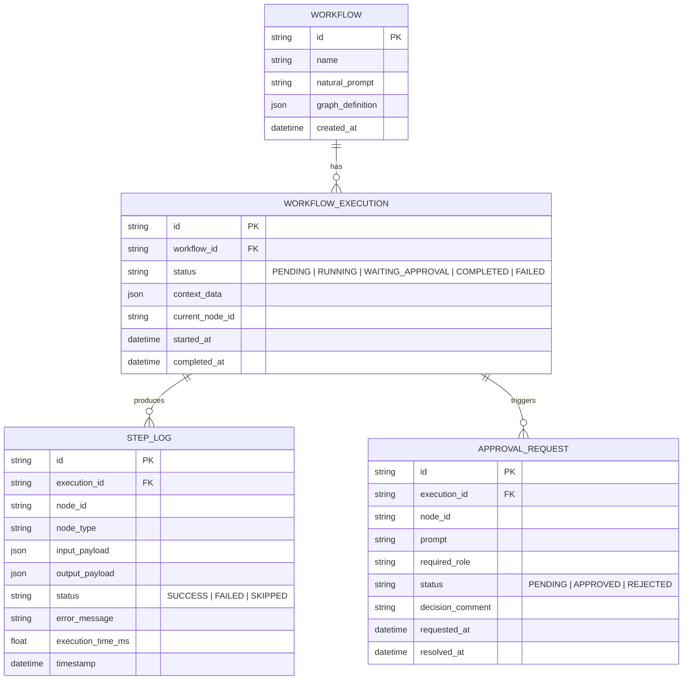

# System Design Document: Natural Language Workflow Generator

**Project**: Natural Language to Executable Workflow Engine  
**Author**: Engineering Team  
**Date**: September 28, 2026  
**Status**: APPROVED - READY FOR IMPLEMENTATION  

---

## 1. Executive Summary & Objective

Business users know their operational objectives (e.g., *"If a refund request exceeds $500, check the fraud score, ask for manager approval, then issue the Stripe refund"*), but lack the technical background to string together APIs, conditional statements, data mappers, and error handlers.

This system is an end-to-end GenAI-powered platform that:
1. Accepts high-level natural language prompts.
2. Compiles them into a deterministic, strongly-typed **Directed Acyclic Graph (DAG)** workflow.
3. Validates the graph structure, schemas, and dependencies.
4. Visualizes the workflow interactively via **Graphviz** inside **Streamlit**.
5. Executes the workflow step-by-step through a **FastAPI** runtime engine with **SQLite** persistence, capable of pausing on human approval and resuming upon action.

---

## 2. High-Level Architecture

```
                       ┌───────────────────────────────┐
                       │     Streamlit User Portal     │
                       │  (Prompt, Graphviz, Approvals)│
                       └───────────────┬───────────────┘
                                       │ HTTP / REST
                                       ▼
                       ┌───────────────────────────────┐
                       │        FastAPI Backend        │
                       └──────┬─────────────────┬──────┘
                              │                 │
           1. NL Compilation  ▼                 ▼  2. Runtime & Execution
         ┌────────────────────────┐         ┌────────────────────────┐
         │     Groq LLM Client    │         │  Workflow DAG Engine   │
         │ (Llama-3.3 JSON Mode)  │         │ (Topological Traversal)│
         └───────────┬────────────┘         └───────────┬────────────┘
                     │                                  │
                     ▼ Validated JSON Spec              ▼ Persist State
         ┌────────────────────────┐         ┌────────────────────────┐
         │   Pydantic Validator   │         │    SQLite3 Database    │
         │  & Graph Cycle Checker │         │ (Runs, Steps, Pending) │
         └────────────────────────┘         └────────────────────────┘
                                                        │
                              ┌─────────────────────────┴────────────────────────┐
                              ▼                         ▼                        ▼
                       [Mock/Real APIs]        [Transformation/Tools]     [Human Approval]
                       (Stripe, Email, etc.)   (Math, JSON, Validation)  (Pause & Resume)
```

---

## 3. Workflow Specification (The "Intermediate Representation")

The core engine does not execute loose text. It executes a strictly typed JSON schema representing a graph composed of `nodes` and `edges`, driven by shared `state` (context).

### 3.1 Node Types

| Node Type | Responsibility | Supported Actions / Config |
| :--- | :--- | :--- |
| `validation` | Checks input parameters, data types, value thresholds | `rules`: checks like `amount > 0`, regex, required fields |
| `tool` | Built-in utility functions (deterministic computations) | `calculate_tax`, `sentiment_analysis`, `score_fraud`, `format_date` |
| `api` | External HTTP REST call simulation or real integration | `method` (`GET`, `POST`), `url`, `headers`, `payload_template` |
| `transform` | Data reshaping, filtering, schema mapping | `expression` or mapping dict `{"total": "$.subtotal + $.tax"}` |
| `condition` | Dynamic branching based on boolean expression | Evaluates expression; routes to `if_true` node or `if_false` node |
| `human_approval` | Suspends execution; raises an approval ticket | `prompt`, `approver_role`, `timeout_seconds` |
| `notification` | Sends alerting or confirmation (email, slack) | `channel`, `recipient`, `message_template` |

### 3.2 Error Handling & Fallbacks

Each node definition contains an optional `on_error` block:
- `retry_count`: Number of immediate retries (e.g., 3).
- `retry_delay_seconds`: Backoff between attempts.
- `fallback_node`: Alternative node ID to route to if all retries fail.
- `fail_workflow`: Boolean indicating whether to fail the entire pipeline or continue with a default value.

---

## 4. Database Schema (SQLite3)

The persistent runtime uses SQLite to guarantee zero data loss and durable pauses during Human-in-the-Loop (HITL) steps.



---

## 5. GenAI Compilation Pipeline (Groq + Llama 3)

### 5.1 System Prompt Design
The Groq prompt provides:
1. Strict JSON schema rules for nodes and edges.
2. Available tools and API registry to eliminate hallucinated endpoints.
3. Few-shot examples demonstrating:
   - Branching (`condition`)
   - Human approval pause (`human_approval`)
   - Safe fallbacks and data transformations.
4. Enforces the node naming convention: `node_1`, `node_2`, etc., with clear edge targets.

### 5.2 Compilation & Self-Healing Loop
```
[User NL Prompt]
      │
      ▼
[Groq LLM Generation (temperature=0.1, response_format=json)]
      │
      ▼
[Pydantic Schema Validation] ───(Fails)───► [Self-Correction Prompt back to Groq]
      │ (Passes)
      ▼
[DAG Cycle & Reachability Check (NetworkX / DFS)]
      │ (Passes)
      ▼
[Save to DB & Render Graphviz]
```

---

## 6. Execution Runtime & State Machine

Execution uses a step-by-step state machine:

1. **Initialization**: Initialize `context` with user-supplied trigger payload (e.g. `{ "order_id": "ORD-123", "amount": 850, "customer_email": "jane@example.com" }`).
2. **Node Traversal**:
   - Determine next executable node (starting at `entrypoint`).
   - Resolve dynamic input expressions from context (e.g. `{{context.amount}}`).
   - Execute node handler.
   - If node is `human_approval`:
     - Update execution status to `WAITING_APPROVAL`.
     - Insert record into `APPROVAL_REQUEST`.
     - Save current context and pause execution.
   - If node is `condition`:
     - Evaluate boolean expression against context.
     - Select either `if_true` target or `if_false` target.
   - Store node outputs into context under `context.nodes[node_id].output`.
   - Log execution details in `STEP_LOG`.
3. **Resume on Approval**:
   - Webhook or UI button `POST /executions/{id}/approve` or `POST /executions/{id}/reject`.
   - Engine loads execution state, records decision, and resumes execution from the next linked node.
4. **Completion**: When no unvisited child nodes remain, mark status `COMPLETED`.

---

## 7. Streamlit UI Design & User Experience

The frontend is divided into two primary views:

1. **Workflow Generator & Visualizer Tab**:
   - Natural language input with quick-select business templates:
     - *High-Value Refund & Fraud Prevention*
     - *Customer Onboarding & Verification*
     - *Server Incident Escalation & DevOps Remediation*
   - "Generate Workflow" button (triggers Groq).
   - Dynamic **Graphviz Flowchart**:
     - Visual shapes & color coding:
       - Green rectangles = API / Tools
       - Orange diamonds = Conditional Logic
       - Blue hexagons = Human Approval Steps
       - Red circles = Error Handling & Fallbacks
   - Raw JSON Inspector & Editor for power users.

2. **Interactive Workflow Runner & Console Tab**:
   - Provide initial mock input parameters.
   - "Run Execution" button.
   - Live step-by-step progress cards showing elapsed time and payload diffs.
   - Interactive **Human Approval Gate**:
     - Prominent action banner: *"Manager Approval Required: Approve refund of $850 for jane@example.com?"*
     - Buttons: `[Approve & Continue]` | `[Reject Workflow]`
   - Final execution summary & JSON output viewer.

---

## 8. Verification & Test Plan

| Test Case | Scenario | Expected Behavior |
| :--- | :--- | :--- |
| **TC-01: Valid DAG Generation** | User enters e-commerce refund prompt | Valid JSON generated, no cycles, starts at validation node. |
| **TC-02: Conditional Branching** | Risk score > 0.7 vs <= 0.7 | Proper routing to either approval path or automatic execution path. |
| **TC-03: Human-in-the-loop** | Execution hits approval node | Engine pauses, status becomes `WAITING_APPROVAL`, resumes when button clicked. |
| **TC-04: Data Transformation** | Mathematical calculation (tax / fee) | State correctly propagated from node output to downstream API input. |
| **TC-05: Error Handling & Retry** | Simulated API timeout | Retry mechanism executes, redirects to fallback alert on exhaustion. |
